Cyclistic Case Study - Bike Sharing Company
================
Octave Antoni

Last updated : May 27th, 2022

# Introduction
Employed as a Data Analyst since February 2019 in the government,
I have decided to continue my education in order to develop my skills
in open-source and widely-used tools and languages such as SQL, R and Tableau. 

After completing the Google Analytics Certificate, this case study puts me in the shoes of a Junior Data Analyst
in charge of providing insights to a Bike Sharing Company about the difference
between 2 types of users : Annual members and casual riders.

Here are the deliverables that I have been tasked to produce :

-   A clear statement of the business task
-   A description of all data sources used
-   Documentation of any cleaning or manipulation of data
-   A summary of your analysis
-   Supporting visualizations and key findings
-   Your top three recommendations based on your analysis

This case study will follow the 6-step data analysis process defined in the 
Google Data Analytics Course :

-   [Ask](#1-ask)
-   [Prepare](#2-prepare)
-   [Process](#3-process)
-   [Analyze](#4-analyze)
-   [Share](#5-share)
-   [Act](#6-act)

Without further ado, let’s get started!

# 1. Ask

The main goal of this phase is to gather all the required information
in order to define a clear business task.

### 1.1 What is the problem I am trying to solve?

Cyclistic has set in place a very flexible pricing plan including single-ride
passes, full-day passes and annual memberships.
Financial analysts at Cyclistic have concluded that annual members are 
much more profitable than casual riders. 
The director of marketing at Cyclistic believes that maximizing the number
of annual members will be the key to future growth.
The end goal is thus to convert casual riders into annual members.

The main problem I am trying to solve is that Cyclistic needs to understand
how to target the casual riders in order to convert them into annual members.

### 1.2 How can my insights drive business decisions?

My insight will allow Cyclistic to better understand the habits and
characteristics of the different types of riders.
This will allow Cyclistic to use an efficient digital marketing strategy that 
will aimat influencing casual riders to become annual riders.

### 1.3 Deliverable : Business Task

**Identify key differences between casual riders and annual members over the
last 12 months and provide insights on how these differences could be used to
increase the conversion rate of casual riders.**

# 2. Prepare

### 2.1 Introducing the data

The dataset used for this case study is a "live" dataset (updated monthly) of 
trips for the Divvy bike sharing company. 
[Dataset link](https://divvy-tripdata.s3.amazonaws.com/index.html).

#### 2.1.1 Dataset Licensing

The data is produced under the following license : 
[Divvy data license agreement](https://ride.divvybikes.com/data-license-agreement)

Contributors willing to use my work will have to comply to the aforementionned
license agreement.

#### 2.1.2 Exploring the data

The dataset is composed of zip files containing csv files, with a separate 
folder for MacOS files. I am asked to study the last 12 months of data, and 
there is 1 zipfile per month. A download of the 2 most recent months highlights 
that **each month of data is composed of more than 300.000 rows of data**. 
I quickly estimate that the last 12 month of data will have more than 3 million 
records. Using a spreadsheet software will not be practical for that amount of 
data, so **I will focus in using SQL at this stage.** 

I will import those datasets in BigQuery in order to be able to run interactive 
SQL queries and merge all of these records. Here is a my dataset structure
after importing the 12 tables into BigQuery.

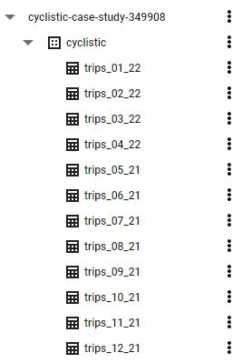

Here is the schema of each table :

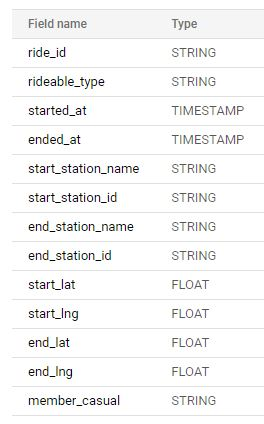

A quick look at the first 10 rows of data shows that the dataset is dirty.
**None of the first 10 rows of the May 21 dataset is complete.**

```SQL
SELECT * 
FROM cyclistic.trips_05_21 
LIMIT 10
```

|ride_id         |rideable_type|started_at          |ended_at            |start_station_name|start_station_id|end_station_name   |end_station_id|start_lat|start_lng|end_lat           |end_lng            |member_casual|
|----------------|-------------|--------------------|--------------------|------------------|----------------|-------------------|--------------|---------|---------|------------------|-------------------|-------------|
|9EFE36756DF82484|electric_bike|2021-05-26T12:14:15Z|2021-05-26T13:03:21Z|                  |                |                   |              |42.0     |-87.7    |41.93             |-87.78             |casual       |
|073149554B9BB87E|electric_bike|2021-05-25T19:09:15Z|2021-05-25T19:24:12Z|                  |                |                   |              |42.0     |-87.67   |42.0              |-87.67             |casual       |
|F09359E7D380D079|electric_bike|2021-05-01T13:35:00Z|2021-05-01T13:58:24Z|                  |                |Clark St & Grace St|TA1307000127  |42.0     |-87.67   |41.950923666666668|-87.659176166666668|casual       |
|2BD0FC8AD3FF2BDD|electric_bike|2021-05-31T21:00:01Z|2021-05-31T21:06:27Z|                  |                |                   |              |42.0     |-87.66   |41.99             |-87.66             |casual       |
|1ED483D94EE5F058|electric_bike|2021-05-22T13:33:06Z|2021-05-22T13:46:12Z|                  |                |                   |              |42.0     |-87.69   |42.0              |-87.69             |casual       |
|D6B99ADAEDB28DC7|electric_bike|2021-05-14T16:21:00Z|2021-05-14T16:36:58Z|                  |                |                   |              |42.0     |-87.66   |42.0              |-87.69             |casual       |
|30BA8917905A05C4|electric_bike|2021-05-02T16:30:07Z|2021-05-02T16:42:53Z|                  |                |                   |              |42.0     |-87.67   |41.99             |-87.69             |casual       |
|057E55CBF19A5118|electric_bike|2021-05-02T15:53:37Z|2021-05-02T16:06:41Z|                  |                |                   |              |42.0     |-87.69   |42.0              |-87.67             |casual       |
|3970D38E8E45A6C4|electric_bike|2021-05-25T16:34:38Z|2021-05-25T17:10:02Z|                  |                |                   |              |42.0     |-87.71   |42.01             |-87.71             |casual       |
|22295616ED41F83B|electric_bike|2021-05-30T15:47:40Z|2021-05-30T15:58:49Z|                  |                |                   |              |42.0     |-87.69   |42.0              |-87.66             |casual       |

Thorough cleaning will be necessary! But first, let's merge the last 12 months 
of datasets.


### 2.2 Merging the tables

Luckily, all of the 12 latest datasets (as of 11 MAY 2022, I will thus use all
data from MAY 2021 to APRIL 2022) have the same schema and column names. 
Merging them will be a piece of cake!

After adding the files to my Google Cloud Storage, I could just merge them
by using a URI request in the CREATE TABLE menu in BigQuery to select all the
csv files `cyclistic_data_set/*.csv`. But for the sake of showcasing my SQL 
skills, I will develop a SQL query to do the exact same thing. 

After looking into cursors to iterate over all tables in my Cyclistic dataset
(which is not compatible with BigQuery), I realize that it is possible to 
iterate over BigQuery tables using a wildcard operator. Here's the query to 
merge all of the 12 tables into a single dataset.

```SQL
CREATE TABLE IF NOT EXISTS cyclistic.trips
OPTIONS(
  description="Combined Cyclistic bike trip data from May 2021 to Avril 2022"
)
AS
  SELECT *
  FROM `cyclistic-case-study-349908.cyclistic.*`;
```

The complete dataset has **5757551 rows**. 


### 2.3 Examining the data

#### 2.3.1 Station information

Since we realized that a lot of station names were missing during our exploration
of the data, let's find out how many rows have incomplete station name OR id.
If we have either the station name or the station id, we will be able to
recuperate the lost data by matching the name or id with another row with the
same name or id.

```SQL
SELECT COUNT(*)
FROM cyclistic.trips
WHERE (start_station_name IS NULL AND start_station_id IS NULL)
      OR (end_station_name IS NULL AND end_station_id IS NULL);
```

After running the query, we have **1.141.802 rows** with no easily recuperable
station name or id. 

That being said, we can perhaps recuperate the lost data by matching the 
coordinates with an identified station at the same coordinates.
Let's verify this :

```SQL
SELECT *
FROM cyclistic.trips
WHERE (
      (start_station_name IS NULL AND start_station_id IS NULL) 
        AND (start_lat IS NOT NULL AND start_lng IS NOT NULL)
      )
      OR 
      (
      (end_station_name IS NULL AND end_station_id IS NULL) 
        AND (end_lat IS NOT NULL AND end_lng IS NOT NULL)
      );
```
We have **1.137.036** records where the station name AND id is absent but we
have full coordinates. That leaves us with only 4766 records with no station
information and coordinates. That's a good start!

Let's save this table for further analysis in the Process phase, although it is 
possible that we will not be able to find matching coordinates.

#### 2.3.2 Member type information

Let's see if all rows in our member_casual field are either equal to "member" 
(annual members) or "casual" (casual riders).

```SQL
SELECT COUNT(*)
FROM cyclistic.trips
WHERE member_casual != "member" AND member_casual !="casual";
```

This returns 0 row. So at least we won't have to clean this field!

#### 2.3.3 Start/End date time information

```SQL
SELECT COUNT(*)
FROM cyclistic.trips
WHERE started_at IS NULL OR ended_at IS NULL;
```

Same result, 0 row without these fields!

Now let's find out if all our datetime information is correct. The dataset I'm 
using starts on May 1st 2021 and Ends on April 30th 2022.

We will run this query : 

```SQL
SELECT 
  MAX(started_at) AS max_start_date,
  MIN(started_at) AS min_start_date,
  MAX(ended_at) AS max_end_date,
  MIN(ended_at) AS min_end_date
FROM cyclistic.trips;
```

| max_start_date |	min_start_date |	max_end_date | min_end_date |
| ------------- |-------------| -----|-----|
| 2022-04-30 23:59:54 UTC | 2021-05-01 00:00:11 UTC | 2022-05-02 00:35:01 UTC | 2021-05-01 00:03:26 UTC|


The max_end_date is in May 2022, but it seems that datasets are ordered by 
start_date and not end_date so this quick review shows that the data seems 
coherent.

We will also compute ride length and see if there are any outlandish values in
there. BigQuery uses the DATETIME_DIFF function :

```SQL
SELECT 
  MAX(DATETIME_DIFF(ended_at, started_at, MINUTE)) AS max_length,
  MIN(DATETIME_DIFF(ended_at,started_at, MINUTE)) AS min_length
FROM cyclistic.trips;
```
Here are the results  :

| max_length |	min_length |
|:-------------:|:-------------:|
|55944|-58|


Seems like we have very high values (55944 minutes is 932 hours or about 39 
days). It is either a false value or a person who forgot to bring back his or
her bike. Negative values are obviously bad records.

Both of these types of records will have to be cleaned if we compute ride times 
because they might bias our results.

Let's count the number of rows with
a ride length over a day :

```SQL
SELECT COUNT(*)
FROM cyclistic.trips
WHERE DATETIME_DIFF(ended_at, started_at, HOUR) >= 24;
```

We get 4186 records. At this stage, it is difficult to say whether these records
are wrong or are just people who forgot to bring back their bikes. More 
information would be needed. These records will have to be excluded in any case
if we want to analyze ride duration.

Now let's count the number of rows with a ride length < 0, choosing seconds
as our DATETIME_DIFF argument to be more precise :

```SQL
SELECT COUNT(*)
FROM cyclistic.trips
WHERE DATETIME_DIFF(ended_at, started_at, SECOND) < 0;
```

The result is 140. We will be able to clean these records without impacting our 
data.

#### 2.3.4 Ride id and rideable_type information

First, let's see what values are in the rideable_type field.

```SQL
SELECT DISTINCT(rideable_type)
FROM cyclistic.trips;
```
Here are our results :

| rideable_type |	
|:-------------:|
|electric_bike|
|classic_bike|
|docked_bike|

Seems like the rideable_type field doesn't contain any error. Now, lets study 
the ride_id.

After counting the disctinct values of ride_id : `SELECT COUNT(DISTINCT(ride_id))
FROM cyclistic.trips` we arrive at the conclusion that there are one distinct 
id per row. We just confirmed that there are no duplicated ids!

Let's see if out ride_id values are the same length :

```SQL
SELECT
  MAX(LENGTH(ride_id)),
  MIN(LENGTH(ride_id)),
  COUNT(DISTINCT(LENGTH(ride_id)))

FROM cyclistic.trips;
```
This query returns 16/16/1. We've just confirmed that all ride_id values are 
unique 16 characters strings. 

#### 2.3.5 Checking for duplicate information

We just verified that all ride_id are unique. But it is possible that ride_ids 
are automatically generated for each row and that some duplication may exist in
other rows.

Let's check this by running a query :
```SQL
SELECT
  rideable_type,
  started_at,
  ended_at,
  start_station_name,
  start_station_id,
  end_station_name,
  end_station_id,
  start_lat,
  start_lng,
  end_lat,
  end_lng,
  member_casual,
  COUNT(*)
FROM `cyclistic-case-study-349908.cyclistic.trips` 
GROUP BY
  rideable_type,
  started_at,
  ended_at,
  start_station_name,
  start_station_id,
  end_station_name,
  end_station_id,
  start_lat,
  start_lng,
  end_lat,
  end_lng,
  member_casual
HAVING COUNT(*) > 1;
```

This query checks for duplicate values outside of the ride_id field.
Turns out that there are in fact **456 duplicate fields**!

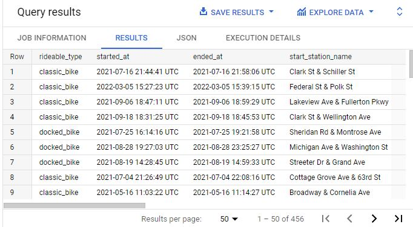

### 2.4 Summary

In the **Prepare** phase, we merged 12 tables and identified which fields have
errors or missing values. We also identified 456 duplicate rows.
We will now clean the data during the **Process** phase.

# 3. Process

The first step of the Process phase is to **backup our database** before we 
apply any changes. I will create a backup of the database in BigQuery.

We will then delete dirty data. In a second part, we will try to recover
missing station information.

### 3.1 Cleaning dirty data

#### 3.1.1 Removing Duplicates

First of all, I will delete from the database duplicate rows outside of ride_id.
Since the started_at and ended_at are timestamped, I assess that it is
impossible that all the other fields are exactly the same without there being
a data collection error.

The query above confirmed that we had 456 duplicate values, but since we
didn't select the ride_id values, it is not practical to find these rows and 
delete them.

We will just add max(id) in the above query to retrieve the ID of of one of
the duplicate rows and delete this row. We also run the same query with 
`HAVING COUNT(*) > 2` and figure out that one row is duplicated twice.

Then we can store our duplicate table in a separate table that we will then
use to delete duplicates from our original database. (A Temporary table would be
ideal but in BigQuery you would have to declare all column names, so it is
much quicker to create a table and then delete it from my dataset.)

```SQL
CREATE TABLE IF NOT EXISTS cyclistic.duplicate_info
  AS
    SELECT
    max(ride_id) AS max_id,
    rideable_type,
    started_at,
    ended_at,
    start_station_name,
    start_station_id,
    end_station_name,
    end_station_id,
    start_lat,
    start_lng,
    end_lat,
    end_lng,
    member_casual,
    COUNT(*) AS duplicate_count
  FROM `cyclistic-case-study-349908.cyclistic.trips` 
  GROUP BY
    rideable_type,
    started_at,
    ended_at,
    start_station_name,
    start_station_id,
    end_station_name,
    end_station_id,
    start_lat,
    start_lng,
    end_lat,
    end_lng,
    member_casual
  HAVING COUNT(*) > 1;
```
Then we can select by ID and remove the duplicates in our main table.

```SQL
DELETE FROM cyclistic.trips
WHERE ride_id IN 
(SELECT max_id FROM cyclistic.duplicate_info);
```

Now we still have a single duplicate row since one row has been duplicated
twice. We run the same query as above to find the duplicate row and find 
a max_id of `79451C756F030041`.

We can now remove our last duplicate :

```SQL
DELETE FROM cyclistic.trips
WHERE ride_id = '79451C756F030041';
``` 

The query is succesful. In total, we removed 457 duplicate rows from our data.
We then delete the duplicate_info table that we created for cleaning purposes.

#### 3.1.2 Removing rows with a ride length <= 0 

That is a pretty simple query :

```SQL
DELETE FROM cyclistic.trips
WHERE DATETIME_DIFF(ended_at, started_at, SECOND) <= 0;
``` 

This removes 652 rows from our database. We will not delete ride lengths of over
24 hours as we have no reason to be sure that this is dirty data. In real life,
we would have asked stakeholders about these records.

### 3.2 Cleaning station information

#### 3.2.1 Fixing incorrect names

We have to run a complex query to retrieve station_ids with mismatched or
missing names.

```SQL
SELECT 
  start_station_id,
  start_station_name,
  COUNT(*) as num_trips

FROM cyclistic.trips

WHERE start_station_id IN 
  (
  SELECT start_station_id
  FROM(
    
    SELECT 
      DISTINCT(start_station_name) as distinct_name,
      start_station_id,
      COUNT(*) AS num_trips
    FROM cyclistic.trips
    WHERE start_station_id IS NOT NULL
    GROUP BY 
      distinct_name,
      start_station_id
    )
  GROUP BY start_station_id
  HAVING COUNT(*)>1
)

GROUP BY
  start_station_id,
  start_station_name

ORDER BY 
  start_station_id,
  num_trips DESC;
```

This query does a lot of things. The innermost nested query retrieves a list of
all distinct start_station names, as well as the number of trips.

The second nested query retrieves a list of station_ids with 2 or more distinct
names (which are not duplicated).

The third query produces the following table (shortened):

|start_station_id|start_station_name                    |num_trips|
|----------------|--------------------------------------|---------|
|13099           |Halsted St & 18th St (Temp)           |1830     |
|13099           |Halsted St & 18th St                  |1804     |
|13221           |Wood St & Milwaukee Ave               |16983    |
|13221           |                                      |1        |
|13300           |DuSable Lake Shore Dr & Monroe St     |25737    |
|13300           |Lake Shore Dr & Monroe St             |18426    |
|20215           |Hegewisch Metra Station               |88       |
|20215           |                                      |1        |
|...           |...      |...     |


Now we can remove from this table, that we saved as `duplicate_station_name`,
the names of station with the least number of trips. The most common station
names will be the ones used in the analysis. In real life, it may be better
to ask stakeholders what is the correct naming convention for each station.

```SQL
DELETE FROM cyclistic.duplicate_station_name
WHERE num_trips IN 
  ( 
  SELECT MIN(num_trips)
  FROM `cyclistic-case-study-349908.cyclistic.duplicate_station_name`
  GROUP BY start_station_id
  HAVING MIN(num_trips)!= MAX(num_trips)
  );
```

We run this script twice (because one of the station_ids had 3 distinct names).
Now we can replace in our main table all the duplicate (or missing) names.
Before doing that, we backup our database in case the script doesn't work.

```SQL
UPDATE cyclistic.trips AS T
SET start_station_name = D.start_station_name
FROM (SELECT start_station_name, start_station_id FROM cyclistic.duplicate_station_name) AS D
WHERE (T.start_station_name is NULL OR T.start_station_name != D.start_station_name) 
	AND T.start_station_id = D.start_station_id;
```

We will also replace end station names based on the same reasoning :

```SQL
UPDATE cyclistic.trips AS T
SET end_station_name = D.start_station_name
FROM (SELECT start_station_name, start_station_id FROM cyclistic.duplicate_station_name) AS D
WHERE (T.end_station_name is NULL OR T.end_station_name != D.start_station_name) AND T.end_station_id = D.start_station_id;
```

Now we verify that the first script returns an empty table and we are
successful! We need to run the same script for end_station_names :

```SQL
SELECT 
  end_station_id,
  end_station_name,
  COUNT(*) as num_trips

FROM cyclistic.trips

WHERE end_station_id IN 
  (
  SELECT end_station_id
  FROM(
    
    SELECT 
      DISTINCT(end_station_name) as distinct_name,
      end_station_id,
      COUNT(*) AS num_trips
    FROM cyclistic.trips
    WHERE end_station_id IS NOT NULL
    GROUP BY 
      distinct_name,
      end_station_id
    )
  GROUP BY end_station_id
  HAVING COUNT(*)>1
)

GROUP BY
  end_station_id,
  end_station_name

ORDER BY 
  end_station_id,
  num_trips DESC;
 ```

The result is the following :

|end_station_id|end_station_name                      |num_trips|
|--------------|--------------------------------------|---------|
|chargingstx1  |Bissell St & Armitage Ave*            |269      |
|chargingstx1  |Bissell St & Armitage Ave - Charging  |2        |

This station_id is not coherent with the others which are either numbers or 
bar code type data.
For thorougness' sake let's clean this data from our database.

```SQL
DELETE FROM cyclistic.trips
WHERE end_station_id = 'chargingstx1' OR start_station_id = 'chargingstx1';
```

This deletes 511 rows from our database. By running the queries looking for 
duplicate names, we find that they both return 0 rows!

### 3.2.2 Retrieving missing information

Let's check if there are station_id with a station_name :

```SQL
SELECT COUNT(*)
FROM cyclistic.trips
WHERE (start_station_name IS NOT NULL AND start_station_id IS NULL)
      OR (end_station_name IS NOT NULL AND end_station_id IS NULL);
```

This return 0, so we either have both station_name and station_id fields
completed or they are both empty.

Now let's count how many records we have with empty station information :

```SQL
SELECT COUNT(*)
FROM cyclistic.trips
WHERE start_station_name IS NULL
      OR end_station_name IS NULL;
```

This returns **1.141.321 records**. That's a lot of missing data. The only
field remaining that could help us recover this data is the coordinates
information.

The only way to efficiently search through coordinates is to merge latitude and
longitude fields together. Let's update the trips database to merge coordinate
information into a single field. First we need to back up our database and
create 2 columns to store this information :

```SQL
ALTER TABLE cyclistic.trips
AFF COLUMN IF NOT EXISTS start_loc GEOGRAPHY;

ALTER TABLE cyclistic.trips
ADD COLUMN IF NOT EXISTS end_loc GEOGRAPHY;
```

Now we can fill these columns by using the ST_GEOGPOINT on the coordinate 
information :

```SQL
UPDATE cyclistic.trips
SET start_coord = ST_GEOGPOINT(start_lng, start_lat)
WHERE TRUE;

UPDATE cyclistic.trips
SET end_coord = CONCAT(end_lat,',',end_lng)
WHERE TRUE;
```

Now, we need to check if the coordinates are consistent for each station_id. 
We have to use CONCAT to compare the distinct coordinates because it is not
possible to use DISTINCT with GEOGRAPHY values :

```SQL
SELECT 
  start_station_id,
  CONCAT(start_lat,',',start_lng) AS start_loc_text,
  COUNT(*) as num_trips
FROM cyclistic.trips

WHERE start_station_id IS NOT NULL AND start_lat IS NOT NULL AND start_lng IS NOT NULL
GROUP BY
  start_station_id,
  start_loc_text
ORDER BY 
  start_station_id,
  num_trips DESC;
```

Just as before, we save this table as `station_coordinates` and assign the most 
frequent coordinate to each id. 

#### 3.2.3 Deleting records with wrong station IDs

**After looking at databases queries, we realize that some station_ids are in
fact station names! We need to clear up those results as well!**

The easiest way to remove those records is to delete records that have spaces 
within their ids. Let's count those records :

```SQL
SELECT COUNT(*)
FROM cyclistic.trips
WHERE start_station_id LIKE '% %' OR end_station_id LIKE '% %';
```
We have only 1394 records, let's delete them from our database.

```SQL
DELETE FROM cyclistic.trips
WHERE start_station_id LIKE '% %' OR end_station_id LIKE '% %';
```

#### 3.2.4 Generating a station_info table with all the information on each station

Now we can generate again our `station_coordinates` database using the same 
query as before. We use the concat function here to make sure that this database 
will only contain distinct ids :


```SQL
DELETE FROM cyclistic.station_coordinates
WHERE CONCAT(num_trips, start_station_id) NOT IN 
  ( 
  SELECT CONCAT(MAX(num_trips), start_station_id)
  FROM cyclistic.station_coordinates
  GROUP BY start_station_id
  );
```

This table returns 846 rows. 

Now we just need to reconvert our geographical coordinates to GEOGRAPHY values.
Let's first add a station_loc column with GEOGRAPHY values :

```SQL
ALTER TABLE cyclistic.station_coordinates
ADD COLUMN IF NOT EXISTS station_loc GEOGRAPHY;
```

Now let's populate this column with the GEOGRAPHY coordinates of each station :

```SQL
UPDATE cyclistic.station_coordinates
SET station_loc = ST_GEOGPOINT(CAST(SPLIT(start_loc_text,',')[OFFSET(1)] AS FLOAT64),CAST(SPLIT(start_loc_text,',')[ORDINAL(1)] AS FLOAT64))
WHERE TRUE;
```

 Now we can generate a table that lists a single station_id / station_name pair.
 I run this query only for start_station_id because with that amount of data
 it is clear that all start_stations were also end_stations and vice versa :

```SQL
SELECT 
  DISTINCT(start_station_name) as station_name,
  start_station_id,
  COUNT(*) AS num_trips
FROM cyclistic.trips
WHERE start_station_id IS NOT NULL
GROUP BY 
  station_name,
  start_station_id
ORDER BY station_name;
 ```

 We save the results of this query as `station_names` in our database. 
 This table also has 846 rows. Now let's merge the station_names and
 station_coordinates into a single table called `station_info`
 that will compile all the information we need on each station :

```SQL
CREATE TABLE IF NOT EXISTS cyclistic.station_info
AS SELECT
		start_station_id AS station_id,
    station_name,
    station_loc,
    start_loc_text AS station_loc_text

FROM
  (SELECT 
    *
  FROM cyclistic.station_names AS names
  JOIN
    (SELECT 
      start_station_id AS id,
      station_loc,
      start_loc_text
    FROM cyclistic.station_coordinates
      ) AS loc
  ON names.start_station_id = loc.id
  )
 ORDER BY station_id;
```

Let's verify that our data doesn't have any blanks :

```SQL
SELECT COUNT(*)
FROM cyclistic.station_info
WHERE station_id IS NULL OR station_name IS NULL OR station_loc IS NULL or station_loc_text IS NULL;
```

Returns 0! Now we can use this table to try to fill the fields with valid
coordinates but no station_id and station_name information.

### 3.3 Filling missing station information

My strategy for this task is the following :

-   For perfect coordinate matches : Update the station_id and station_names
		fields where the coordinates match perfectly with the station_info table
-   For partial coordinate matches : Create a table with all partial matches 
of the coordinates in the trips database with the station_loc_text field.
-		For each match per ride_id, compare the distance between the 2 coordinates
		and validate the match based on the closest distance if it is within 50m.


#### 3.3.1 Perfect matches

Let's count the number of perfect matches. Since we didn't aggregate location
data in the `trips` database, we have to use CONCAT to match it to our
station_loc_text :

```SQL
SELECT COUNT(*)
FROM cyclistic.trips
WHERE 
  (start_station_id IS NULL AND CONCAT(start_lat,',',start_lng) IN (SELECT station_loc_text FROM cyclistic.station_info))
  OR
  (end_station_id IS NULL AND CONCAT(end_lat,',',end_lng) IN (SELECT station_loc_text FROM cyclistic.station_info));
```

Returns 357.200! So we will be able to easily fill 357.200 records. Let's 
backup our trips database and update it.

First we need to CONCAT the start/end lat and long in order to have a single coordiantes field :

```SQL
ALTER TABLE cyclistic.trips
ADD COLUMN IF NOT EXISTS 
  start_loc_text STRING,
ADD COLUMN IF NOT EXISTS end_loc_text STRING;


UPDATE cyclistic.trips
SET start_loc_text = CONCAT(start_lat,',',start_lng),
    end_loc_text = CONCAT(end_lat,',',end_lng)
WHERE TRUE;

ALTER TABLE cyclistic.trips
DROP COLUMN IF EXISTS start_lat,
DROP COLUMN IF EXISTS start_lng,
DROP COLUMN IF EXISTS end_lat,
DROP COLUMN IF EXISTS end_lng;
```
Now let's join our main database with our station_info database :

```SQL
UPDATE cyclistic.trips AS A
SET 
  A.start_station_name = D.station_name,
  A.start_station_id = D.station_id
FROM 
  (
  SELECT 
    T.ride_id,
    I.station_name,
    I.station_id
  FROM cyclistic.trips AS T
  JOIN cyclistic.station_info AS I
  ON 
    T.start_station_name IS NULL 
    AND T.start_loc_text = I.station_loc_text
  ) AS D
WHERE A.ride_id = D.ride_id;
```

This query fails because there are multiple matches. Seems like we have 
duplicates in our station_info database. Let's delete the station_loc_text 
information of all stations with duplicate coordinates :

```SQL
UPDATE cyclistic.station_info
SET station_loc_text = NULL
WHERE station_loc_text IN
  (SELECT station_loc_text FROM 
    (
    SELECT 
      station_loc_text,
      COUNT(*) AS num_duplicates
    FROM cyclistic.station_info
    GROUP BY
      station_loc_text
    HAVING num_duplicates > 1
    )
  )
 ```

 Now we can run the UPDATE query above. Let's write the same query for missing 
 end_station information :

```SQL
UPDATE cyclistic.trips AS A
SET 
  A.end_station_name = D.station_name,
  A.end_station_id = D.station_id
FROM 
  (
  SELECT 
    T.ride_id,
    I.station_name,
    I.station_id
  FROM cyclistic.trips AS T
  JOIN (SELECT * FROM cyclistic.station_info) AS I
  ON 
    T.end_station_name IS NULL 
    AND T.end_loc_text = I.station_loc_text
  ) AS D
WHERE A.ride_id = D.ride_id;
 ```
Now that we updated perfect matches, but we still have **948616** rows with 
missing station information and valid coordinates.

#### 3.3.2 Partial coordinate matches

The best way to do that would be to base our results on the following table :

```SQL
SELECT
  T.ride_id,
  ST_DISTANCE(T.start_loc,I.station_loc) AS distance,
  I.station_name,
  I.station_id,
  T.start_loc_text,
  I.station_loc_text
FROM cyclistic.trips AS T
JOIN cyclistic.station_info AS I
ON
  T.start_station_name IS NULL
  AND LEFT(I.station_loc_text, 5) = LEFT(T.start_loc_text, 5)
  AND LEFT(SPLIT(T.start_loc_text,',')[OFFSET(1)],5) = LEFT(SPLIT(I.station_loc_text,',')[OFFSET(1)],5) 
  AND ST_DISTANCE(T.start_loc,I.station_loc) < 100;
 ```
 
 The problem is that we realize by running a MAX(LENGTH(start_loc_text)) query 
 that the coordiantes of the remaining stations with no station_id are only 
 2 digits, which represents an imprecision of over 1km in the coordinates! 
 Matching them partially would give us wrong results and would bias our data 
 in the favor of stations which have 'round' coordinates. We decide not to use 
 these imprecise results. In the analysis part, we will have to exclude the 
 trips without station information if we want to analyze which stations are 
 prefered by both kinds of riders.

 Before analyzing the results, let's create 2 new rows : one with the distance 
 travelled from start to finish stations, and another with the trip length in 
 minutes.

### 3.4 Creating length_min and distance_m fields

First let's back up our database. Then we will run the following queries :

```SQL
ALTER TABLE cyclistic.trips
ADD COLUMN IF NOT EXISTS length_min FLOAT64,
ADD COLUMN IF NOT EXISTS distance_m FLOAT64;

UPDATE cyclistic.trips
SET length_min = DATETIME_DIFF(ended_at, started_at, MINUTE)
WHERE TRUE;

UPDATE cyclistic.trips
SET distance_m = ROUND(ST_DISTANCE(start_loc, end_loc),0)
WHERE LENGTH(start_loc_text) >= 14 AND LENGTH(end_loc_text) >=14;
 ```

We choose not to calculate the distance of trips with imprecise start and end 
coordinates because it could bias our results, we choose at least 3 digits 
for our coordinate precision (=14 characters because we have negative longitudes).
We ROUND our distance values because the ST_DISTANCE value returns 13 decimals
and a precision up to 1m is sufficient here. This represents **4,587,796 rows**
on our table.

Let's see a quick recap of what our distance and length fields show :

|max_length|min_length|avg_length        |max_distance|min_distance|avg_distance      |
|----------|----------|------------------|------------|------------|------------------|
|55944.0   |0.0       |20.097648195342565|33800.0     |0.0         |2107.3670278713585|

That's good for now, we have an average trip length of 20 minutes and an average
distance of 2107m! Let's keep in mind that the distance mentionned here are 
not the distance travelled by users, but only the distance between start and 
end stations. It is of course possible that users just tour the city and return
their bikes at the same start station.

# 4. Analyze

We will accomplish the analyze phase of the case study by utilizing R. 
Let's import our 'trips' database to R.

First we load and install the required packages. I also change my locale to 
English (as I am French) to be able to handle months in English :

```R
install.packages("bigrquery")
install.packages("tidyverse")
install.packages("wk")
install.packages("lubridate")

library(bigrquery)
library(tidyverse)
library(wk)
library(lubridate)
Sys.setlocale("LC_TIME", "English")
 ```

Then we set up our connection to Bigquery and assign it to the "trips" dataframe.
This dataframe will not be collected (i.e. it is not stored on our computer)
but we will have do manually collect this data using collect() every time
we want to access it.

```R
con <- dbConnect(
  bigrquery::bigquery(),
  project = "cyclistic-case-study-349908",
  dataset = "cyclistic",
  billing = "cyclistic-case-study-349908"
)

trips <- tbl(con,"trips")
glimpse(trips)
 ```
### 4.1 Number of monthly rides per user type

First we download a subset of our data in order to be able to quickly run queries
on it without needing BigQuery access. 

```R
length_info <-
  trips %>% 
  select(member_casual,started_at,length_min,rideable_type) %>% 
  collect() %>% 
  mutate(month_year = factor(format(started_at, "%b-%y"), levels = 
           c("May-21","Jun-21","Jul-21","Aug-21","Sep-21","Oct-21","Nov-21","Dec-21","Jan-22","Feb-22","Mar-22","Apr-22")), 
  			Date = date(started_at))
 ```

In the mutate function, we add a Date and month-year column that we extract from the
started_at column, and we use the levels argument to order the months and years
in chronological order.

Now we can use this table to draw a graph of rides per day for each Member type :

```R
length_info %>% 
  group_by(Date,member_casual) %>% 
  summarize(rides=n()) %>% 
  ggplot(aes(x=Date,y=rides,group=member_casual,color=member_casual)) + geom_point() %>% 
  labs(color="Member Type", x="Date", y="Number of Rides") + scale_y_continuous(labels = scales::comma)+ 
  geom_smooth() + scale_x_date(date_labels="%b-%y",date_breaks  ="1 month",expand = c(0,0))+
  ggtitle("Rides per day for each Member Type")
 ```

 This gives us the following graph :

  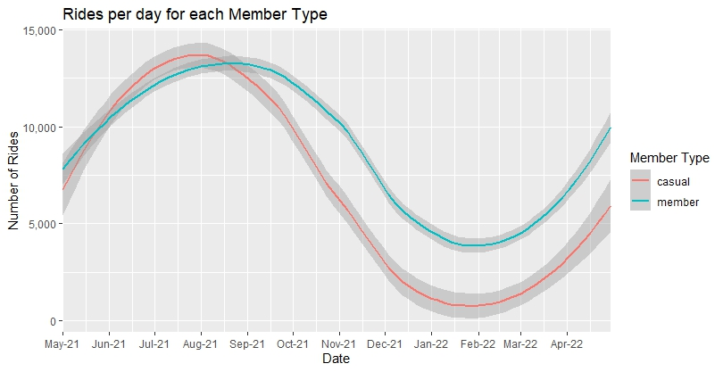

 We come to the conclusion that there are much more casual members during the
 summer than during the winter where annual members outnumber casual members.


### 4.2 Analyzing length data

We will use the same table to compute length per month graph :

```R
length_info %>% 
  filter(length_min<1440) %>% 
  group_by(month_year,member_casual) %>% 
  summarise(average_length = mean(length_min)) %>% 
  ggplot() + geom_col(aes(x=month_year,y=average_length,fill=member_casual),position = 'dodge') + 
  labs(fill="Member Type", x="Month", y="Ride Length")
 ```
We get the following chart, that was produced by removing trip lengths of
over 24 hours : 

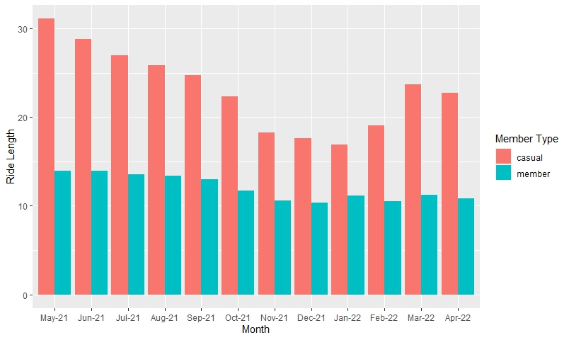

 It is clear that Casual members ride much longer than annual members. The peak
 seems to be in Spring, although analysis of several years would be needed to 
 validate this hypothesis.

### 4.3 Analyzing the distance between start and end stations

Just as the length previously analyzed, we will see if there's a difference
between the average distance between the start and end stations used by our
2 groups. 
First let's create a subset of our data with the interesting information :

```R
distance_info <-
  trips %>% 
  select(member_casual,started_at,distance_m,rideable_type) %>% 
  collect() %>% 
  mutate(month_year = factor(format(started_at, "%b-%y"), levels = 
                               c("May-21","Jun-21","Jul-21","Aug-21","Sep-21","Oct-21","Nov-21","Dec-21","Jan-22","Feb-22","Mar-22","Apr-22")))
 ```

 Now we will create the same graph but for our distance between start and end
 stations :

```R
distance_info %>% 
  filter(distance_m >= 0) %>% 
  group_by(month_year,member_casual) %>% 
  summarise(average_dist = mean(distance_m)) %>% 
  ggplot() + geom_col(aes(x=month_year,y=average_dist,fill=member_casual),position = 'dodge') + 
  labs(fill="Member Type", x="Month", y="Distance from start to end station")
```

Here is our result :

 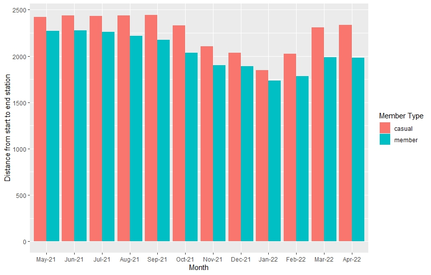

It seems that the distance is slightly higher for casual members, although the
spread is not very significant.

### 4.4 Bike types used by both categories of user

We can use a pie chart to represent what bike types our 2 groups use :

```R
distance_info %>% 
  select(member_casual, month_year, rideable_type) %>% 
  group_by(rideable_type,member_casual) %>% 
  summarise(bike_count = n()) %>% 
  mutate(bike_count = ifelse (member_casual == "member", 100*bike_count/tally(distance_info, member_casual == "member")[[1,1]],
                              100*bike_count/tally(distance_info,member_casual == "casual")[[1,1]])) %>% 
  ggplot() + geom_bar(aes(x="",y=bike_count,fill=rideable_type),stat="identity", width=1) +
  coord_polar("y", start=0) + facet_wrap(~member_casual)
```

We use the geom_bar and coor_polar functions to create a pie chart instead of 
using R's built in pie function in order to be able to create 2 facets.
Here are our resuls (the appearance of the pie chart will need to be improved
but for now we only want the results) :

 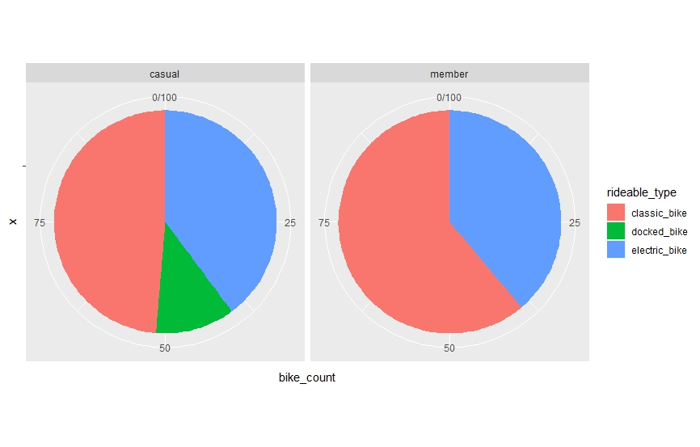

We discover that only Casual members use a category of bikes called docked_bike.
After further analysis and searching through Divvy's website, it appears that
docked_bikes are a type of electric bikes. We can thus aggregate electric_bike
and docked_bikes in the same category for our pie chart :

```R
distance_info %>% 
  select(member_casual, month_year, rideable_type) %>% 
  group_by(rideable_type,member_casual) %>% 
  summarise(bike_count = n()) %>% 
  mutate(bike_count = ifelse (member_casual == "member", 100*bike_count/tally(distance_info, member_casual == "member")[[1,1]],
                              100*bike_count/tally(distance_info,member_casual == "casual")[[1,1]])) %>% 
  mutate(rideable_type = ifelse(rideable_type == "docked_bike", "electric_bike", rideable_type)) %>% 
  ggplot() + geom_bar(aes(x="",y=bike_count,fill=rideable_type),stat="identity", width=1) +
  coord_polar("y", start=0) + facet_wrap(~member_casual)
```

Here are our results : 

 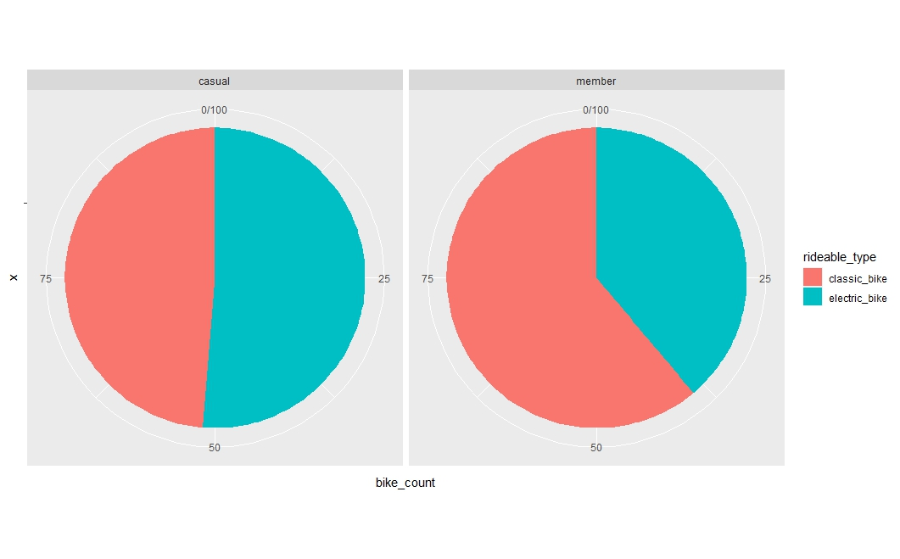

To gain some time and get a cleaner chart, we will use Excel to display it :

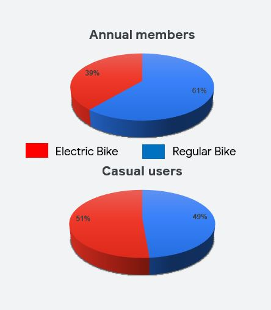

It appears that **Casual members use electric bikes for more than 50 percent of
their usage**.

### 4.5 Analyzing station usage

#### 4.5.1 Top 5 stations for each user groups

Now we will see what are the top stations of each member type. For speed's sake,
we will only consider the top 5 stations for each member type here but in
reality it may be necessary to study the top 10 or 20 stations.

First let's download a subset of our dataset that we will call station_db :

```R
station_db <-
  trips %>% 
  select(member_casual,started_at,start_station_name,end_station_name,rideable_type) %>% 
  filter(!is.na(start_station_name)) %>% 
  collect() %>% 
  mutate(month_year = factor(format(started_at, "%b-%y"), levels = 
                               c("May-21","Jun-21","Jul-21","Aug-21","Sep-21","Oct-21","Nov-21","Dec-21","Jan-22","Feb-22","Mar-22","Apr-22")))

```

We will only study start stations here as we've shown in the Process phase that
there are no significant differences between start and end stations counts.
We thus remove rows with empty start_station information. We also create a
labeller to make the graphs we will plot more readable :

```R
member_names <- c(
  `casual` = "Casual",
  `member` = "Annual Member"
)
```

Now let's analyze our data to find out which are the top stations for each
member type :

```R
station_db %>% 
  select(member_casual,month_year,start_station_name) %>%
  group_by(member_casual,start_station_name) %>% 
  summarize(ride_count = n()) %>%
  mutate(ride_perc = ifelse(member_casual == "member", 100*ride_count/tally(station_db,member_casual == "member")[[1,1]],
        100*ride_count/tally(station_db,member_casual == "casual")[[1,1]])) %>% 
  arrange(member_casual, desc(ride_perc)) %>% 
  group_by(member_casual) %>% 
  mutate(rank = rank(-ride_perc)) %>% 
  filter(rank<=5) %>% 
  ggplot(aes(x=start_station_name, y=ride_perc, fill=member_casual)) + geom_col() +
  facet_wrap(~member_casual,scales = "free_x", labeller = as_labeller(member_names)) + 
  aes(stringr::str_wrap(start_station_name, 15), ride_perc) + xlab(NULL) +
  ylab("Percentage of total rides") + ggtitle("Top 5 stations") + labs(fill="Member type")
```

First we calculate a ride_count for each member_casual - start_station_name duo.
Then we translate this amount to a percentage of the total number of rides for
each member type (ride_perc). We then attribute ranks to each of these columns 
(we have to rank by -ride_perc to have an ascending order). 

This gives us the following graph :

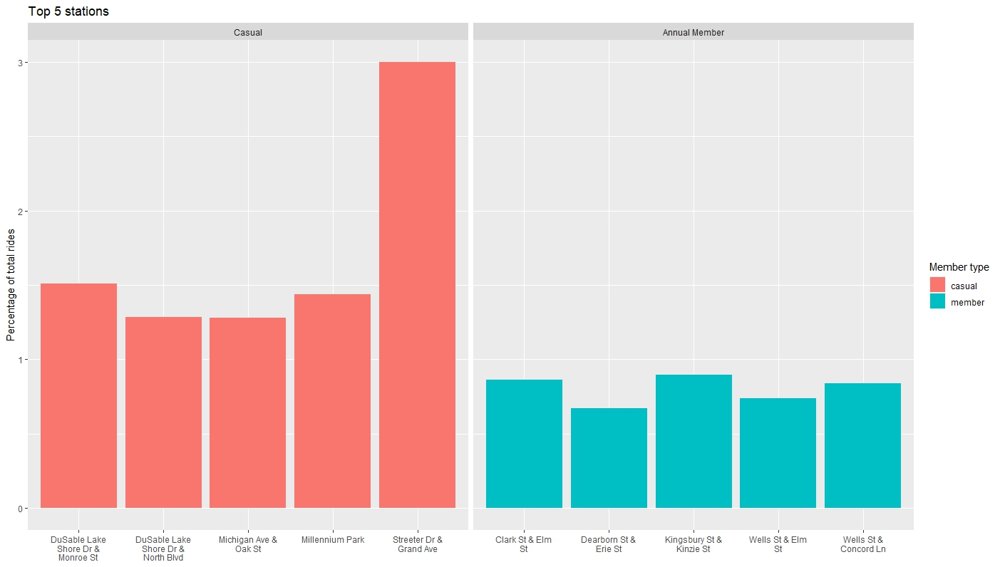

We can see right away that different member types do not have the same top
stations. Also, it is interesting to note that **the traffic from casual
members is concentrated in fewer stations than annual members** as the 
percentage from top stations is higher.

#### 4.5.2 Creating a map of rides per station

The easiest way to represent the station data is by using a map to see the
most relevant trends. To do this, we will begin by creating a subset with only
the relevant data :

```R
station_map <-
  trips %>% 
  select(member_casual,start_station_id) %>% 
  filter(!is.na(start_station_name)) %>% 
  filter(!is.na(start_loc_text)) %>%
  collect () %>% 
  mutate(month_year = factor(format(started_at, "%b-%y"), levels = 
                               c("May-21","Jun-21","Jul-21","Aug-21","Sep-21","Oct-21","Nov-21","Dec-21","Jan-22","Feb-22","Mar-22","Apr-22")))

```

Now we created during the process phase a station_info table with all the
relevant information about each station. The problem is that the coordinates
are present within a GEOGRAPHY type data that will be complicated to use in R.
So first we need to modify the station_info table to add Longitude and Latitude
data :

```SQL
ALTER TABLE cyclistic.station_info
ADD COLUMN IF NOT EXISTS Latitude FLOAT64,
ADD COLUMN IF NOT EXISTS Longitude FLOAT64;
```

Now it appears that some station_loc_text field were not correctly entered.
Let's update this field from the GEOGRAPHY data as well as the Latitude and
Longitude fields :

```SQL
UPDATE cyclistic.station_info
SET station_loc_text = CONCAT(ST_Y(station_loc),",",ST_X(station_loc)),
    Latitude = CAST(ST_Y(station_loc) AS FLOAT64),
    Longitude = CAST(ST_X(station_loc) AS FLOAT64)
WHERE TRUE; 
```

Now we can import this table in R, and create a summary by month, member_type 
and station showing the number of rides from our station_map table :

```R
station_info <- tbl(con,"station_info") %>% collect()

map_export <-
  station_map %>% 
    select(member_casual,start_station_id, month_year) %>% 
    group_by (member_casual,start_station_id,month_year) %>% 
    summarize(rides = n())
```
We just need to join those 2 tables to have all the information we need for the
table :

```R
map_final <-
  map_export %>%
  setNames(c("Member type","station_id","month_year","rides")) %>% 
  full_join(station_info,by="station_id")
```

Now we have a table with the following fields :

-  Member type
-  station_id 
-  month_year 
-  rides 
-  station_name                 
-  station_loc                
-  station_loc_text                     
-  Latitude 
-  Longitude

We can import this table into tableau, change the type of data for our
month_year column from String to Date, and browse our results. All the Tableau
data is publicly available on my profile 
(https://public.tableau.com/app/profile/octave.antoni), but I extracted the most
relevant information so they can be directly browsed :

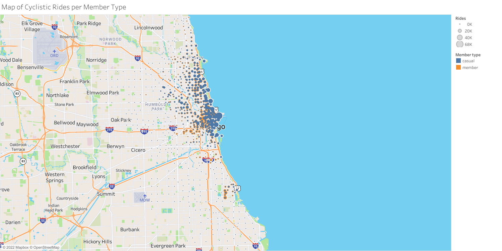

We can see that the traffic is mostly concentrated around the Downtown and Hyde
Park areas. Let's zoom into those areas :


As we can see, the blue dots (casual member traffic) are much wider around the
Harbor and Lakeside areas while annual members are more represented in the
Western part of Chicago. **Concentrating our marketing strategy on users located
in the vicinity of the Lake seems to be a good strategy to mainly target casual
members.**

Let's look at a close up on the Hyde Park Area now :

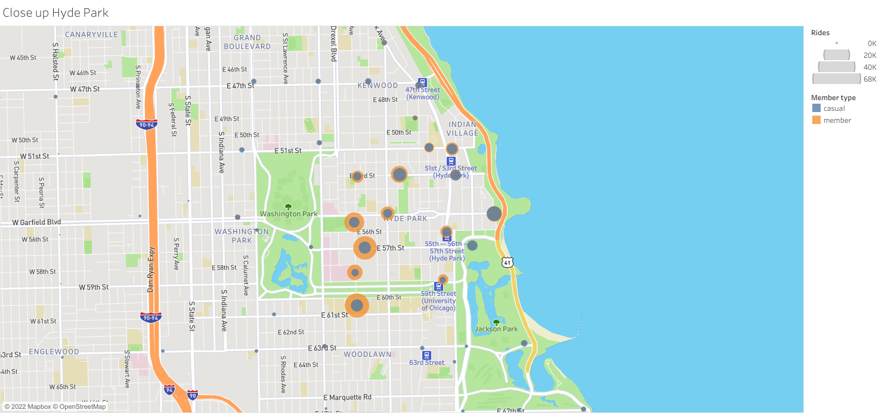

The same tendancy is visible on this area : casual members are mostly present
near the lake side areas while the western areas are mostly used by Annual
members. 

#### 4.5.3 Monthly evolution of our rides

Now that we have all this data, it would also be interesting to see how the data
evolves over a year. So I create a page in Tableau and an auto-scrolling
animation in order to show the monthly evolution of our ride numbers :

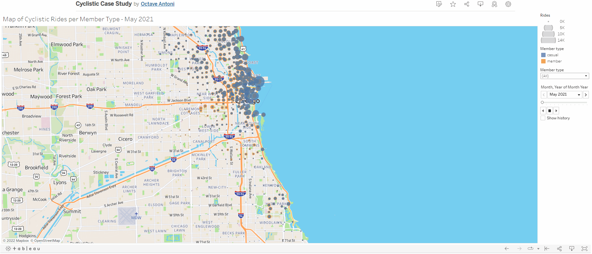

We can clearly see that there are very high seasonal peaks of casual members 
from May to September-October and that for the rest of the year most of the
rides are done by annual members.

**The best period to target casual members seem to be from May to October**. 
Although more data collection would be needed to validate this hypothesis, **it
is likely that the months of May, September and October are ideal because
there is probably less tourists that won't be good targets for our marketing
strategy.**

#### 4.5.4 Top stations for both categories

Now one of the way we could target our casual members is to target the casual
members that use the same stations as annual members, which are probably
stations more likely to be used by Chicagoans that we would like to convert
to an annual membership.

To do that, we will create a table that ranks each station by member_type, and
only selects stations that are top 30 for both kinds of member_types. We will
then join this table with our station_info table in order to have the relevant
station information for display :

```R
ranked_map <-
  map_final %>% 
  group_by(`Member type`,station_id) %>% 
  summarise(rides = sum(rides)) %>% 
  arrange(`Member type`, desc(rides)) %>% 
  group_by(`Member type`) %>% 
  mutate(rank = rank(-rides)) %>% 
  filter(rank<=30) %>% 
  group_by(station_id) %>% 
  filter(n()>1) %>% 
  summarise(total_rides = sum(rides), average_rank = mean(rank)) %>% 
  left_join(station_info,by="station_id") %>% 
  arrange(average_rank)

write.csv(ranked_heatmap,"ranked_heatmap.csv")
```

Now we can analyze this data directly on Tableau (Cyclistic Top Stations viz on
my [Tableau Profile](https://public.tableau.com/app/profile/octave.antoni)) :

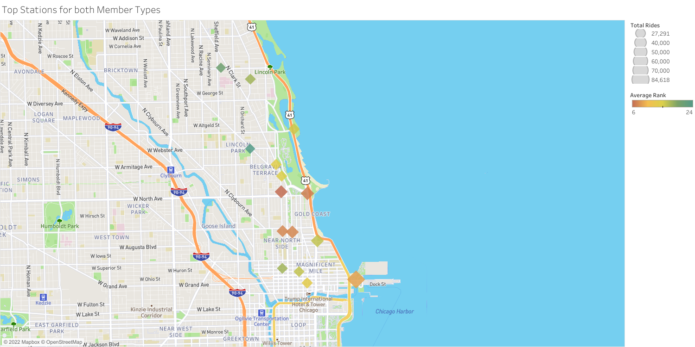

The color indicates the average of the ranks of the station for each study group
and the size of the marker indicates the volume of rides. **Targeting these
stations is likely to be an efficient strategy**.


That's it for our Analysis, we will now Share our findings with our simulated
stakeholders by creating a Powerpoint presentation displaying our results.

# 5. Share

I have created a **draft presentation** aimed at high level executives in order
to present the results of this case study. [Link to the presentation](Cyclistic_Data_Analysis_Presentation.pptx)

A more technical version of this presentation could also be produced if the
results of the study were to be presented to fellow data analyts or to a more
technical audience.

# 6. Act

Based on the aforementionned presentation, here are my recommendations :

-  Target top stations  for both user groups in order to select casual members 
likely to be Chicagoans. 

-  Avoid focusing too much marketing efforts on the summer months due to the 
presence of tourists. Spring seems to be the best conversion period due to the
 high ride number / tourist ratio.

-  Outline the advantages of electric bikes and the possibility of doing long 
rides in the marketing strategy.

### Additional analysis that could be made

I hypothesized in my presentation that the peak of casual riders in the summer
months was due to an increase in tourists, but I was not able to find monthly
tourist data for Chicago to prove this hypothesis.

It would also be useful to have access to the actual user database from Divvy in
order to reach more precise conclusions as to each user group habits.


